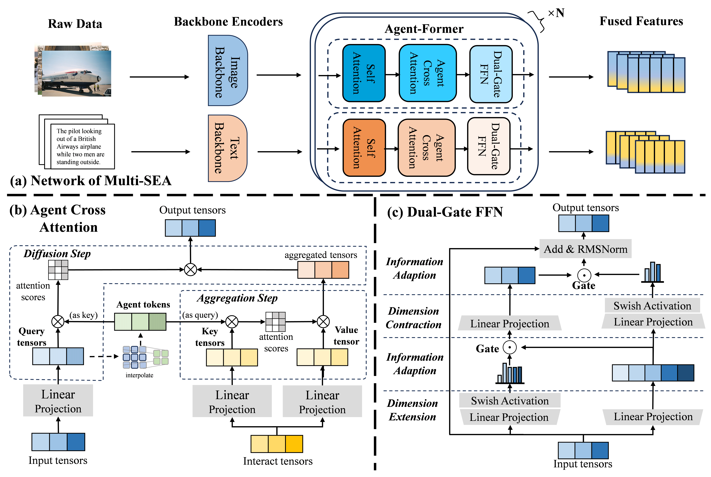
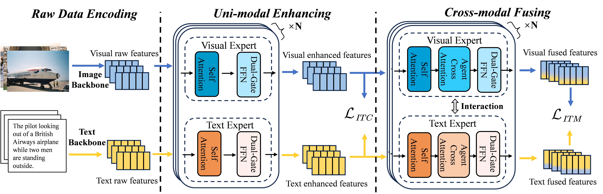

# Multi-SEA: Multi-stage Semantic Enhancement and Aggregation for Image-Text Retrieval

## Introduction
We propose a Multi-stage Semantic Enhancement and Aggregation framework (**Multi-SEA**) with novel networks and training schemes. Multi-SEA first designs a fusion module with agent attention and gating mechanism. It enhances uni-modal information and aggregates fine-grained cross-modal information by involving different stages. Multi-SEA then introduces a three-stage scheme to integrate the two structures mentioned above together. 

 

Eventually, Multi-SEA utilizes a negative sample queue and hierarchical scheme to facilitate robust contrastive learning and promote expressive capabilities from implicit information. Experimental results demonstrate that Multi-SEA outperforms the state-of-the-art schemes with a large margin.

 

## Backbone pretrained models
We employ the Roberta-base model and Vit-B/16 model as the backbones to preliminarily encode our raw data, which can be found in following links quickly.

| Visual Backbone | Text Backbone |
|------------------------|-------------------------------------------|------|------|------|------|-----|
| [vit-b-16](https://openaipublic.azureedge.net/clip/models/5806e77cd80f8b59890b7e101eabd078d9fb84e6937f9e85e4ecb61988df416f/ViT-B-16.pt) | [Roberta-base](https://drive.google.com/file/d/1ddE0BSYxvdQLAH0t6fTk5UCV1a9B6q7x/view?usp=drive_link) | 

